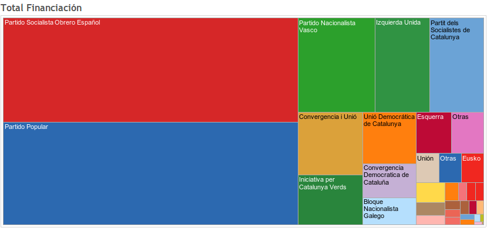
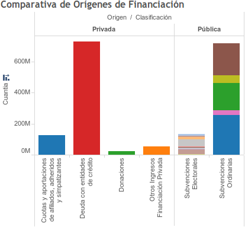
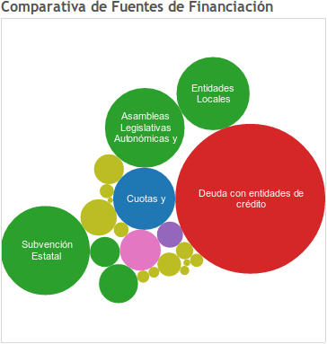

Informe 2009-2011 de Fiscalización de los estados contables de los Partidos Políticos
=====================================================================================

Exploración visual de los recursos financieros de las formaciones políticas de España 2009-2011. 
Fuente original de datos: <a href="http://www.tcu.es/Layout/DesktopLayout/DetalleInforme.aspx?ID=1001">"Informe de fiscalización de los estados contables de los partidos políticos y de las donaciones percibidas por las fundaciones vinculadas orgánicamente, ejercicios 2009, 2010 y 2011"</a> por el <a href="http://www.tcu.es">Tribunal de Cuentas de España</a> (pags. 22-30).

Un documento que nos acerca un poco a al opaco mundo de la financiación de los partidos es el <a href="http://www.tcu.es/Layout/DesktopLayout/DetalleInforme.aspx?ID=1001">Informe 2009-2011 de fiscalización de los estados contables de los partidos políticos</a> que publicaba a finales de Octubre de 2013 el Tribunal de Cuentas. Se trata de un documento, de carácter técnico, que presenta tanto resúmenes como datos, tanto conclusiones como recomendaciones.

En este repositorio puedes encontrar una transcripción a datos abiertos (csv, ods, xlsx) de las tablas presentes entre las páginas 22 y 30 del mencionado informe. Estas tablas contienen el agregado de todas las fuentes de financiación entre 2009 y 2011 de los partidos obligados a rendir cuentas según la Ley de Financiación de Partidos. Sobre estos datos se ha realizado un set de visualiaciones para facilitar la exploración. A través de las distintas pestañas puede explorarse los datos de financiación de los partidos políticos entre 2009 y 2011 desglosado por formación política o por tipo de financiación.

<a href="http://public.tableausoftware.com/views/FinanciacindePartidosPolticos2009-2011v2/VistazoPorPartidos#1"></img></a>

<table>
<tr>
<td><a href="http://public.tableausoftware.com/views/FinanciacindePartidosPolticos2009-2011v2/VistazoPorTipoFinanciacin#1"></img></a></td>
<td><a href="http://public.tableausoftware.com/views/FinanciacindePartidosPolticos2009-2011v2/VistazoPorTipoFinanciacin#1"></img></a></td>
</tr>
</table>

<b>Os comparto mis <em>insights</em></b>:
<ul>
<li>Entre 2009 y 2011 los partidos obligados a declarar ante el Tribunal de Cuentas han recibido un total de más de <a href="http://public.tableausoftware.com/views/FinanciacindePartidosPolticos2009-2011v2/ComparativaFuentesFinanciacin">1.700 millones de euros</a>, de los que 850 millones corresponden a financiaciónn pública, 202 millones fuentes privadas y 730 millones en préstamos con entidades de crédito.</li>
<li>El bipartidismo se hace patente: <a href="http://public.tableausoftware.com/views/FinanciacindePartidosPolticos2009-2011v2/TotalFinanciacin#1">PP y PSOE acumulan más de la mitad del total</a> (1.000 millones de euros).</li>
<li>Entre 2009 y 2011 <a href="http://public.tableausoftware.com/shared/WHRKR892Z?:display_count=no">PSOE recibió algo más de financiación privada</a>, <a href="http://public.tableausoftware.com/shared/2RFD8QM4R?:display_count=no">PP algo más de financiación pública</a> y el total recibido en préstamos es parecido.</li>
<li>Tras PP y PSOE son <a href="http://public.tableausoftware.com/shared/HJ34XYB2Q?:display_count=no">PNV e IU los que abanderan la recepción de fondos por vías de financiación privada</a>.</li>
<li>Sólo en 2011 las entidades de crédito concedieron 275 millones de euros al total de los partidos políticos, <a href="http://public.tableausoftware.com/shared/53BKKP8K6?:display_count=no">un 20% más respecto de 2010</a>. <a href="http://public.tableausoftware.com/shared/JF4J7JPGP?:display_count=no">El TOP 3 de partidos que reciben donaciones entre 2009 y 2011</a> son (por este órden): PSOE, PSC y PP. De todos los procesos electorales celebrados fueron las elecciones locales de 2011 las que más dinero restaron a las arcas públicas (43 millones de Euros), <a href="http://public.tableausoftware.com/shared/7HQZRBH7T?:display_count=no">un 50% más que las elecciones generales de 2008 y 2011 juntas</a></li>
</ul>
